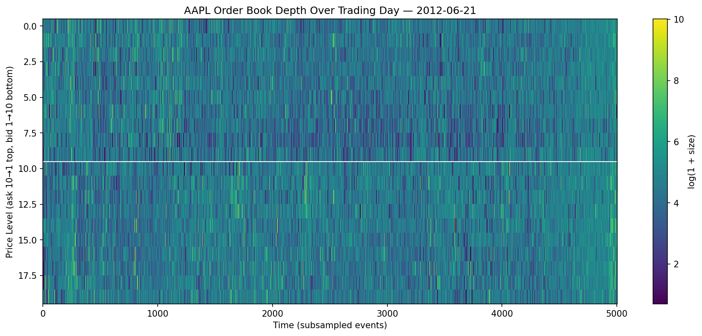
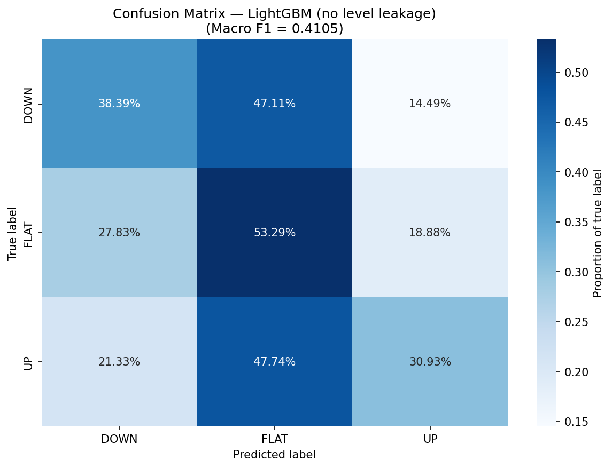
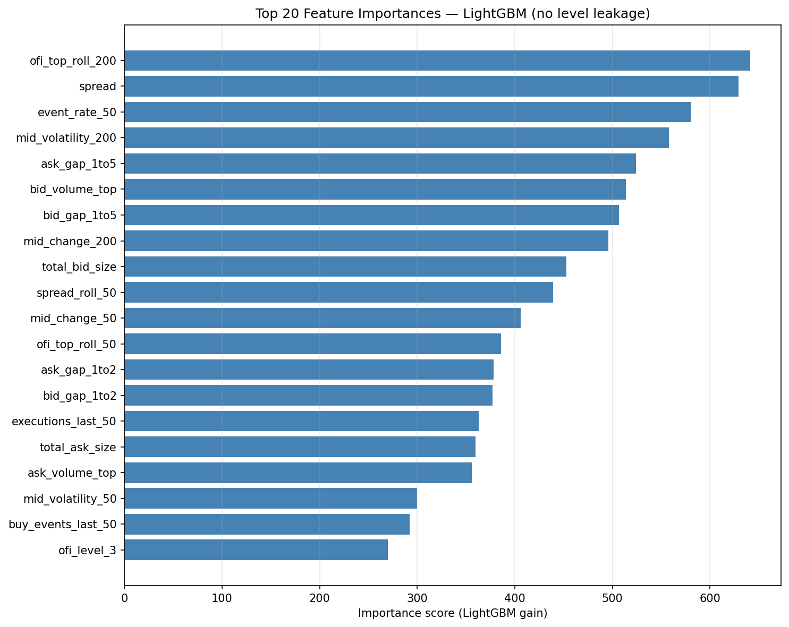
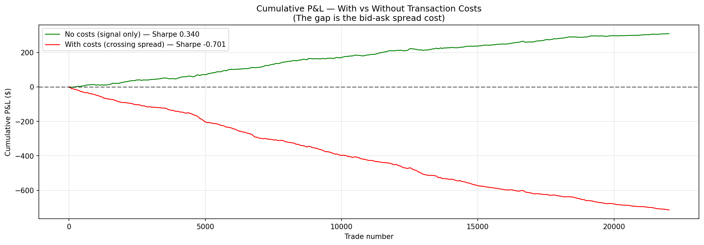

# LOB Mid-Price Prediction

Predicting short-term mid-price direction on NASDAQ AAPL using limit order book microstructure features and gradient boosting.

## Headline Results

| Metric | Value |
|---|---|
| Test macro F1 | **0.4105** |
| Test accuracy | 43.3% |
| Lift over random baseline | **+24%** (F1: 0.41 vs 0.33) |
| Lift over majority-class baseline | **+96%** (F1: 0.41 vs 0.21) |
| Trained on | 280K events (70%) of AAPL 2012-06-21 LOBSTER data |
| Tested on | 60K events (15%, held out, no shuffling) |
| Per-trade Sharpe (raw signal) | **+0.34** across 22K trades |
| Per-trade Sharpe (after spread costs) | -0.70 |

## What This Project Does

For each snapshot of the AAPL limit order book (10 levels, 400K snapshots across one trading day), this model predicts whether the mid-price will rise, fall, or stay flat 50 events into the future. It is trained on **36 engineered microstructure features** including order-flow imbalance (multiple variants), the microprice signal, weighted book pressure, rolling volatility, message-flow rates, and inter-event timing.

## Key Plots

### Order Book Depth Across One Trading Day

Liquidity heatmap of the full 10-level book over ~5,000 subsampled events. Bright vertical streaks correspond to large orders entering or exiting the book. The horizontal white line separates ask levels (top) from bid levels (bottom).

### Confusion Matrix

Final model on the held-out test set. The model correctly identifies 38% of DOWN moves and 31% of UP moves, with off-diagonal "catastrophic" errors (DOWN→UP and UP→DOWN) below 22% in both directions.

### Feature Importance

The top features are all real microstructure signals — sustained order-flow imbalance (`ofi_top_roll_200`), spread, event rate, and rolling volatility dominate. No absolute-level features survived after diagnosing and removing price-level leakage.

### Paper Trading P&L: With vs Without Transaction Costs

The signal generates +$309 raw profit (Sharpe +0.34) across 22,000 trades. Crossing the bid-ask spread on each trade absorbs $0.046 per round-trip — converting the edge into a $714 net loss. This isolates *signal quality* from *execution cost*, the central tension in HFT economics.

## Approach

### Data
- **Source:** LOBSTER academic samples (NASDAQ ITCH-decoded, 10 levels)
- **Stock and day:** AAPL, 2012-06-21
- **Volume:** 400,391 LOB snapshots + matching message events

### Labels
- **Horizon:** 50 events ahead
- **Threshold:** 0.15 × median spread ($0.0225) — only price moves exceeding this magnitude are labeled UP or DOWN
- **Final label distribution:** FLAT 39%, DOWN 32%, UP 30% — class-balanced for fair training

### Features (36 total)
1. **Order-flow imbalance variants:** top-of-book, deep, weighted-by-distance, levels 1/3/5
2. **Microprice signal:** `micro_minus_mid` (volume-weighted mid adjustment)
3. **Rolling statistics:** OFI rolling means (50, 200), mid-price volatility (50, 200), rolling spread
4. **Momentum:** mid-price change over 50 and 200 events
5. **Book structure:** ask/bid gaps between levels 1-2 and 1-5
6. **Message flow:** rolling counts of new orders, cancels, executions, buy/sell events
7. **Timing:** inter-event delta, rolling event rate

### Model
- **Algorithm:** LightGBM multiclass classifier
- **Key choices:** time-based 70/15/15 train/val/test split, class weighting to combat label imbalance, early stopping on validation log-loss
- **Hyperparameters:** 1000 trees max, learning_rate 0.03, num_leaves 15, max_depth 6, L1/L2 regularization

### Why these choices?
- **Time-based (not random) split:** prevents future-information leakage, which would inflate accuracy by 5-15%.
- **Class weighting:** without it, the model trivially predicted FLAT for all rows (the original 92% "accuracy" trap before properly evaluating with macro F1).
- **Dropping `mid_price` and `microprice` from features:** the first model trained with these had `mid_price` as the #1 feature, meaning the model had memorized day-specific price levels rather than generalizable signals. Removing them *improved* generalization despite reducing the feature count.

## What I Learned

1. **Accuracy is dangerous on imbalanced data.** Macro F1 and class-specific recall are the right metrics for LOB direction prediction.
2. **Feature importance is a leakage detector.** When `mid_price` appeared in the top 10, it signaled the model was learning levels, not signals. The fix was simple but the discovery was earned.
3. **Signal ≠ profit.** A model with positive Sharpe on raw signal can still lose money after realistic spread costs. The gap is the entire HFT industry.
4. **Time-series ML demands time-based splits.** Randomly shuffling rows leaks future into the past.

## Limitations and Future Work

- **Single day, single stock.** The model is fit and tested on one session of AAPL. Cross-day and cross-stock generalization remain unverified.
- **No latency modeling.** Trades are assumed to execute at the price observed at signal time. In reality, signal latency would push fills further into the future.
- **No queue position modeling.** Maker-side execution (which would eliminate spread cost) requires modeling queue depth and fill probability — a natural next step.
- **Static threshold.** The labeling threshold was tuned manually; an adaptive volatility-scaled threshold (e.g., σ-based) would generalize better across regimes.

## Repository Structure


## Reproducing Results

```bash
# 1. Clone and enter the repo
git clone https://github.com/Aniirudhgoyal/lob-midprice-prediction.git
cd lob-midprice-prediction

# 2. Set up environment
python -m venv venv
source venv/bin/activate   # Windows: venv\Scripts\activate
pip install -r requirements.txt

# 3. Download AAPL LOBSTER sample from lobsterdata.com/info/DataSamples.php
# Place CSVs in data/ folder

# 4. Run notebooks in order: 01 → 03 → 04
```

## References

- Cont, R., Stoikov, S., Talreja, R. (2010). *A stochastic model for order book dynamics.* Operations Research.
- Zhang, Z., Zohren, S., Roberts, S. (2019). *DeepLOB: Deep convolutional neural networks for limit order books.* IEEE Transactions on Signal Processing.
- LOBSTER data: lobsterdata.com (Huang & Polak, 2011)

---

**Author:** Anirudh Goyal · IIT Delhi, Chemical Engineering · anirudhgoyal.iitd@gmail.com